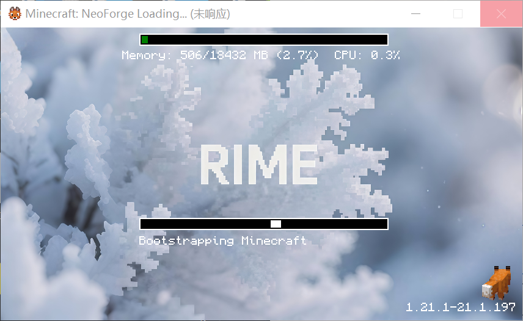

# ❓ 常见问题 FAQ

这里收集了玩家们最常遇到的问题和解决方案。如果你的问题不在此列，请在 QQ 群内咨询。

## 🔧 技术问题

### Q：启动客户端时卡在`Bootstrapping Minecraft`阶段不动



这通常是 i18n 无法联网导致的，请直接删除 i18n 模组（不会影响汉化，i18n 模组与 i18n 资源包是分离的）

### Q: 游戏启动失败，提示 Java 相关错误？

**A:** 这通常是 Java 版本问题：

1. **检查 Java 版本**
   ```bash
   java -version
   ```
2. **确保使用正确 JDK 版本（不是 JRE！）**

3. **重新安装 Java**
   - 卸载旧版本 Java
   - 从官网下载最新版本
   - 重启电脑后重试

### Q: 游戏内存不足，经常崩溃？

**A:** 内存分配不当是主要原因：

**ATM10 推荐设置：**

- 最小分配：6GB
- 推荐分配：8-10GB
- 系统内存需求：16GB+

**GTNH 推荐设置：**

- 最小分配：8GB
- 推荐分配：10-12GB
- 系统内存需求：16GB+

**设置方法：**

1. 在启动器中找到 JVM 参数设置
2. 修改 `-Xmx` 参数，如 `-Xmx10G`
3. 确保不要分配超过系统总内存的 80%

### Q: 游戏卡顿严重，FPS 很低？

**A:** 优化建议：

**显卡设置：**

- 更新显卡驱动到最新版本
- 在显卡控制面板中为 Minecraft 设置高性能模式

**游戏内设置：**

- 降低渲染距离（推荐 8-12 区块）
- 关闭光影和材质包
- 调低颗粒效果设置
- 关闭 VSync 垂直同步

**JVM 优化：**
使用优化的启动参数（见入服教程）

### Q: 无法连接服务器？

**A:** 按以下步骤排查：

1. **检查网络连接**

   - 确保能正常访问互联网
   - 尝试 ping mc.abreeze.icu

2. **确认整合包版本**

   - 使用服务器指定的整合包版本
   - 避免自行添加或移除模组

3. **防火墙和杀毒软件**

   - 将 Minecraft 添加到防火墙白名单
   - 临时关闭杀毒软件重试

4. **重置网络设置**
   ```bash
   ipconfig /release
   ipconfig /renew
   ipconfig /flushdns
   ```

## 🎮 游戏相关

### Q: 可以在两个区服之间切换吗？

**A:** 可以，但需要注意：

- 两个区服使用不同的整合包
- 需要分别安装对应的客户端
- 存档和进度是独立的
- 建议专注于一个区服以获得更好体验

### Q: 新手应该如何快速上手？

**A:** 建议的学习路径：

**ATM10 新手：**

1. 完成初始任务书引导
2. 学习基础的科技模组（如 Thermal Series）
3. 参考 JEI 合成表
4. 寻找经验丰富的队友

**GTNH 新手：**

1. 必须阅读官方指南和社区教程
2. 从蒸汽时代开始循序渐进
3. 做好长期游戏的心理准备
4. 加入新手友好的团队

## 🏗️ 建筑和资源

### Q: 可以在服务器上建造大型建筑/机器吗？

**A:** 可以，但请遵循以下原则：

**建造规范：**

- 合理选择建造地点，避免影响他人
- 大型建筑请提前在群内沟通
- 注意服务器性能，避免过度复杂的红石电路
- 长期离线的建筑可能会被清理

**推荐做法：**

- 先建造小型原型测试性能
- 使用高效的设计方案
- 定期检查和维护设施

### Q: 资源分配和交易规则？

**A:** 服务器鼓励合作和交易：

**资源开采：**

- 公共资源可以合理开采
- 大型矿脉建议多人合作
- 注意环境保护，填坑种树

**交易系统：**

- 鼓励玩家间物品交换
- 可以建立商店和交易区
- 使用游戏内经济系统

## 🛠️ 模组使用

### Q: 可以自己添加模组吗？

**A:** 不推荐，原因如下：

- 可能导致无法连接服务器
- 增加游戏不稳定性
- 影响与其他玩家的兼容性
- 可能违反服务器规则

如果需要特定模组，直接艾特群主就可以啦，如果不是私活模组的话大概率会在下个整合包版本给你加上~

### Q: 如何快速学习模组使用？

**A:** 学习资源推荐：

**游戏内帮助：**

- JEI/REI 合成查看
- 任务书系统指引
- 模组内置说明书

**外部资源：**

- B 站相关教程视频
- 模组官方文档
- 社区制作的指南
- 群内老玩家指导

## 💬 社区相关

### Q: QQ 群的作用是什么？

**A:** QQ 群是重要的交流平台：

**群功能：**

- 服务器公告和更新通知
- 新手指导和问题解答
- 寻找队友和组建团队
- 分享游戏心得和建筑
- 活动组织和参与

**群规则：**

- 保持友善和尊重的交流环境
- 避免刷屏和无关话题
- 技术问题优先在群内讨论
- 遵循群管理员的指导

### Q: 如何举报违规行为？

**A:** 举报渠道：

1. **QQ 群内私聊管理员**
2. **游戏内使用举报命令**
3. **提供详细的违规证据**

**举报信息应包含：**

- 违规玩家 ID
- 违规行为详细描述
- 发生时间和地点
- 相关截图或录像证据

## 📞 获取更多帮助

如果以上内容无法解决你的问题：

### 联系方式

**QQ 群**: 567367746

- 加群时请说明遇到的具体问题
- 群内有经验丰富的玩家和管理员

**官方网站**: [rime.abreeze.icu](https://rime.abreeze.icu/)

**文档站点**: [docs.abreeze.icu](https://docs.abreeze.icu/)

### 反馈建议

我们欢迎各种形式的反馈：

- 服务器改进建议
- 文档完善建议
- 新功能需求
- 活动策划想法

---

_本 FAQ 会持续更新，感谢玩家们的反馈和建议！_ 🙏
