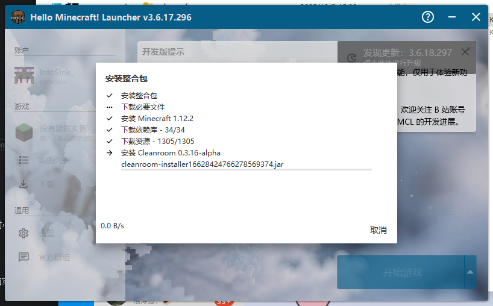
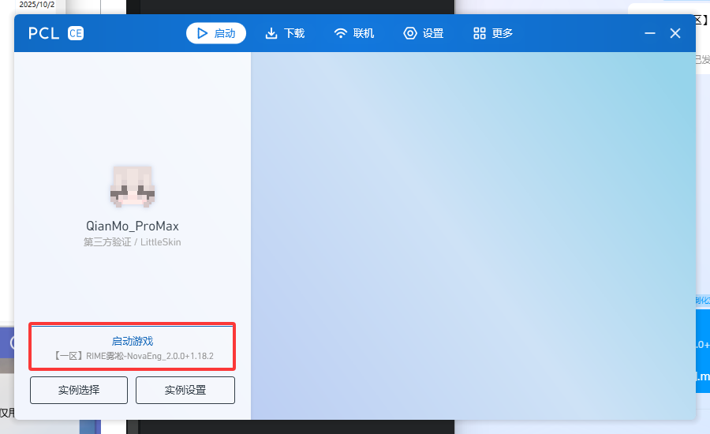

# 📝 入服教程

本教程将指导你从零开始，完成客户端安装到成功进入服务器的全过程。

::: tip 提示

- 在进行期间遇到的任何异常情况，可以尝试在 [常见问题](faq.md) 找到解决方法
- 本教程以安装一区客户端为例，二区客户端可类比安装
  :::

## 🔧 准备工作

### 系统要求

| 项目          | 要求                                          |
| ------------- | --------------------------------------------- |
| **Java 版本** | 新星周目: GraalVM JDK21<br>GTNH: Dragonwell JDK8 |
| **内存**      | 建议 10GB+ 可用内存                           |
| **存储空间**  | 新星周目: 至少 10GB<br>GTNH: 至少 8GB            |
| **网络**      | 稳定的互联网连接                              |
| **账号**      | LittleSkin 账号                               |

### Java 安装检查

在开始之前，请确认你的电脑已安装对应版本的 JDK：

1. 按 `Win + R` 打开运行窗口
2. 输入 `cmd` 并回车
3. 在命令行中输入：

   ```bash
   java -version
   ```

4. 如果显示版本号且为对应版本，则可以继续

::: warning 注意
如果没有安装或版本过低，请前往 [Oracle 官网](https://www.oracle.com/java/technologies/javase-downloads.html) 下载安装。
:::

## 🆔 注册 LittleSkin

如果你没有 LittleSkin 账号，请先 [注册](https://littleskin.cn/auth/register)，否则可跳过此部分。

注册并登录后，请按照 LittleSkin 的官方文档完成准备工作：

👉 [LittleSkin 官方文档 - 准备工作](https://manual.littlesk.in/newbee/#%E5%87%86%E5%A4%87%E5%B7%A5%E4%BD%9C)

需要完成的步骤：

- ✅ 验证邮箱
- ✅ 创建角色
- ✅ 设定材质

## 📦 客户端安装

### 🎯 方式一：一键包安装（推荐）

::: tip 推荐理由

- 配置简单，开箱即用
- 预配置 LittleSkin 登录
- 内置一键进服功能
  :::

#### 步骤 1：下载一键包

1. 在 QQ 群文件内点击 **"RIME 雾凇 MC 客户端"** 进入文件夹
2. 根据你要进入的区服选择对应的一键包下载


#### 步骤 2：解压安装

1. 下载完成后，使用压缩软件解压到新文件夹

   > 推荐使用 **Bandizip** 进行解压

   

2. 打开 **HMCL 启动器**

   ::: info 首次启动
   第一次启动会下载 JavaFX 依赖，请耐心等待（速度较快）
   :::

   

   有更新请点击“忽略”

3. 等待自动安装客户端（5-20 分钟）

::: warning 安装提示

- 如果没有自动安装，可以把modpack.zip拖到启动器窗口
- 如果速度过慢，可以开启 VPN 代理加速
- 如果按照失败，可以重新打开 HMCL 启动器，然后开启 VPN 代理加速
- 期间出现长时间 0% 是正常情况，这是在安装 Cleanroom，请耐心等待
  :::

#### 步骤 3：登录 LittleSkin

启动器已预配置 LittleSkin 登录，**无需手动配置**，直接填写账号密码即可。

::: tip 提醒
进入服务器的前提是需要 LittleSkin 登录，如果没有账号请先按照上面的步骤注册。
:::

#### 步骤 4：启动游戏

1. 填写好账号密码后，点击 **启动游戏**

2. 等待游戏启动（首次启动时间较长）

   | 电脑配置 | 预期启动时间      |
   | -------- | ----------------- |
   | 配置较差 | 8-10 分钟甚至更长 |
   | 配置较好 | 至少 2 分钟以上   |

   ::: info macOS 用户注意
   启动时可能会遇到界面闪烁的情况，这是正常现象，请忽略。
   :::

3. 进入主界面后，可以在“选择服务器”中找到雾凇服务器了！

🎉 **至此，你可以愉快地游玩了！**

### 🔧 方式二：手动安装/懒人包

::: warning 复杂度提醒
手动安装较为复杂，**强烈推荐使用一键包方式**。
PCL官方版本不支持Cleanroom，可以使用PCL2-CE或Forge
:::

::: info 适用场景

- 不喜欢使用 HMCL 启动器
- 想要一二区客户端共存
  :::

#### 步骤 1：选择启动器

如果你使用 HMCL，请直接使用一键包方式。

本教程以 **PCL2-CE + Windows 11** 为演示，其他启动器可以类比操作。

::: tip 系统提示
非Windows系统不支持PCL2 / PCL2-CE!
:::

#### 步骤 2：下载 PCL2 启动器

1. 访问 [PCL2-CE Github Releases](https://github.com/PCL-Community/PCL2-CE/releases)

2. 找到最新的 **Pre-release**，然后在Assets中下载 `PCL2-CE_Beta_x64.exe`（ARM架构需下载 `PCL2-CE_Beta_ARM64.exe`）

3. 将下载的文件移动到新文件夹，双击启动

4. 下载整合包文件

   - 在 QQ 群文件内点击 **"RIME 雾凇 MC 客户端"**
   - 选择对应区服的懒人包下载

   

#### 步骤 3：安装版本

1. 使用压缩软件将刚刚下载的懒人包解压到**你刚刚新建的文件夹（包含启动器）**目录

   | 系统     | 推荐工具 |
   | -------- | -------- |
   | Windows  | Bandizip |
   | 其他系统 | 7-zip    |

2. 完成！

#### 步骤 4：配置 LittleSkin

进入服务器需要 LittleSkin 登录，请参考官方文档进行配置：

👉 [LittleSkin 官方文档 - HMCL3](https://manual.littlesk.in/yggdrasil/client#hmcl-3)

#### 步骤 5：启动游戏

完成上述步骤后即可启动游戏！

   ::: tip 提示
   如果打开提示“请输入实例名称”，直接点击取消即可！
   :::



## 👥 加入 QQ 群

::: tip 强烈建议
在进服前请先加入 QQ 群，获取最新信息和技术支持！
:::

### 🔗 QQ 群号：567367746

::: warning 重要提醒
加群后请**第一时间查看群公告**，那里有你想要的一切信息！
:::

#### 群内福利

| 服务内容          | 详细说明                     |
| ----------------- | ---------------------------- |
| 📢 **服务器公告** | 最新活动、维护通知、版本更新 |
| 🆘 **新手指导**   | 专业的入门教学和问题解答     |
| 💬 **玩家交流**   | 与其他玩家分享游戏心得       |
| 🔧 **技术支持**   | 客户端、模组等技术问题解决   |

## 🔍 常见问题

如果遇到问题，可以通过以下方式寻求帮助：

- 📖 查看 [常见问题 FAQ](faq.md)
- 💬 在 QQ 群内咨询
- 🎮 游戏内询问其他玩家

## ✅ 入服完成

🎉 **恭喜！** 如果你成功连接到了服务器，那么你已经完成了入服流程。

### 🚀 新手建议

| 步骤 | 建议内容   | 说明                         |
| ---- | ---------- | ---------------------------- |
| 1️⃣   | **先逛逛** | 熟悉服务器环境和基础设施     |
| 2️⃣   | **看任务** | 查看任务书了解游戏目标和进度 |
| 3️⃣   | **找队友** | 在群里或游戏内寻找合适的伙伴 |
| 4️⃣   | **问问题** | 遇到困难及时在群内寻求帮助   |

### 📋 服务器规则

在开始游戏之前，请务必阅读：

👉 **[服务器规则](./rules.md)**

---

🌟 **欢迎来到 RIME · 雾凇，开始你的科技之旅吧！** 🎉
