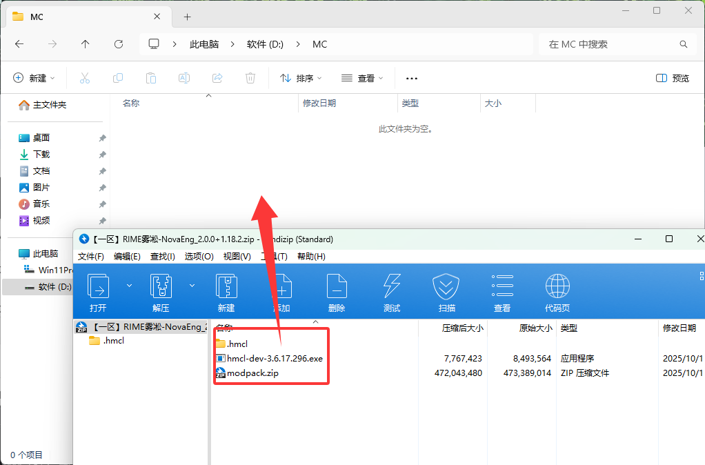
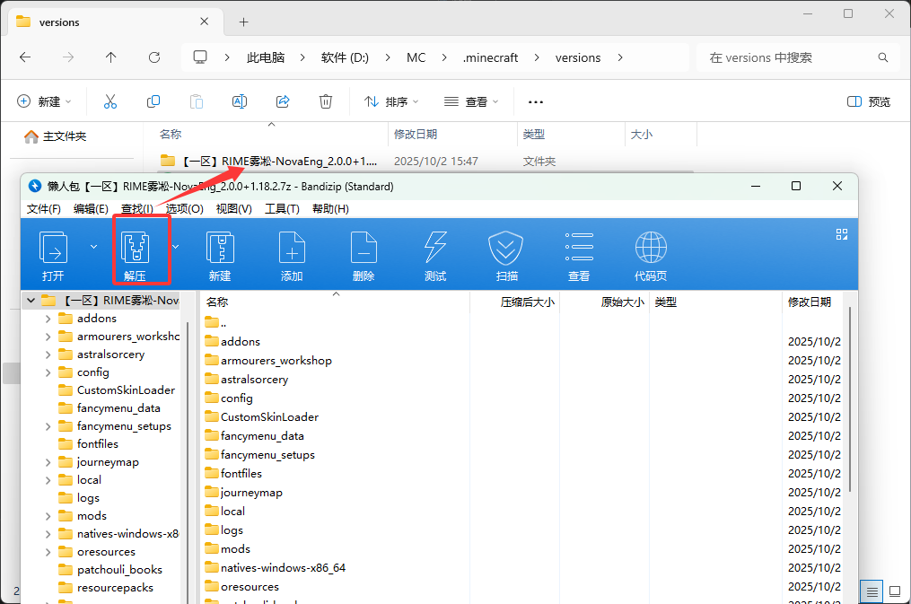

# 📝 入服教程

本教程将指导你从零开始，完成客户端安装到成功进入服务器的全过程。

::: tip 提示

- 在操作过程中遇到任何异常情况，可以先尝试在 [常见问题](faq.md) 中查找解决方法
- 本教程以安装第一区服客户端为例，第二区服客户端的安装步骤基本相同
- 本教程以 Windows 10 系统、JDK 21 环境为例进行演示，其他版本可类比参考
  :::

## 🔧 准备工作

### 系统要求

| 项目          | 要求                                         |
| ------------- | -------------------------------------------- |
| **Java 版本** | 推荐 64 位 JDK 21                            |
| **内存**      | 建议物理内存 16GB 及以上，至少预留 10GB 可用 |
| **存储空间**  | 建议预留 20GB+ 可用存储空间，推荐安装在 SSD  |
| **网络**      | 能顺利访问 CurseForge 和 Modrinth            |
| **账号**      | LittleSkin 账号                              |

### Java 安装检查

在开始之前，请确认你的电脑已安装推荐的 JDK 版本（JDK 21）：

1. 按 `Win + R` 打开“运行”窗口
2. 输入 `cmd` 并回车，打开命令提示符
3. 在命令行中输入：

   ```bash
   java -version
   ```

4. 如果显示的版本号为 **21**，且为 64 位（`64-Bit`），则可以继续使用；否则建议按下文重新安装

::: warning 注意
如果没有安装 Java，或版本不是 **64 位 JDK 21**，请前往 [Zulu 官网](https://www.azul.com/downloads/?version=java-21-lts&package=jdk#zulu) 下载并安装对应版本。
:::

## 🆔 注册 LittleSkin

如果你没有 LittleSkin 账号，请先 [注册](https://littleskin.cn/auth/register)，否则可跳过此部分。

注册并登录后，请按照 LittleSkin 的官方文档完成准备工作：

👉 [LittleSkin 官方文档 - 准备工作](https://manual.littlesk.in/newbee/#%E5%87%86%E5%A4%87%E5%B7%A5%E4%BD%9C)

需要完成的步骤：

- ✅ 验证邮箱
- ✅ 创建角色
- ✅ 设定材质

## 📦 客户端安装

### 🎯 一键包安装

::: tip 推荐理由

- 配置简单，开箱即用
- 预配置 LittleSkin 登录
- 内置一键进服功能
  :::

#### 步骤 1：下载一键包

1. 在 QQ 群文件内找到并进入 **「RIME 雾凇 MC 客户端」** 文件夹
2. 根据你要进入的区服，下载对应的一键包压缩文件


#### 步骤 2：解压与导入整合包

1. 下载完成后，使用压缩软件将一键包解压到一个新的、路径简单的文件夹（例如 `C:\Minecraft\RIME`）

   > 推荐使用 **Bandizip** 进行解压

   

2. 在解压后的文件夹中，打开自带的 **HMCL 启动器**

   ::: info 首次启动
   第一次启动会下载 JavaFX 依赖，请耐心等待（速度较快）。
   如有更新提示，可暂时点击“忽略”。
   :::

3. 将 `Export-RIME_GregTech_Odyssey.mrpack` 文件拖拽到 HMCL 启动器窗口中，按提示完成整合包导入

   

4. 等待安装客户端（5-20 分钟）

   

   ::: warning 安装提示

   - 如果速度过慢，可以开启 VPN 代理加速
   - 如果安装失败，可以重新打开 HMCL 启动器，然后开启 VPN 代理加速
   - 期间出现长时间 0% 是正常情况，这是在安装模组加载器，请耐心等待
     :::

   当提示“安装成功”后，点击“确定”。

#### 步骤 3：登录 LittleSkin

本客户端已预先配置好 LittleSkin 登录。

1. 在启动器左侧点击 **账户** 入口

   

2. 在“添加账户”中选择 `LittleSkin`

   

3. 在弹出的窗口中，输入你的 LittleSkin 用户名和密码完成登录

::: tip 提醒
用户名通常为你的 LittleSkin 账户名或注册邮箱。

进入服务器前必须先使用 LittleSkin 登录，如尚未注册账号，请先完成前文中的注册步骤。
:::

#### 步骤 4：启动游戏

1. 填写好账号密码后，点击 **启动游戏**

2. 等待游戏启动（首次启动时间可能较长，属于正常现象）

   | 电脑配置 | 预期首次启动时间  |
   | -------- | ----------------- |
   | 入门配置 | 8–10 分钟甚至更长 |
   | 较好配置 | 通常不少于 2 分钟 |

3. 进入主界面后，可以在“多人游戏”的服务器列表中找到雾凇服务器！

🎉 **至此，你已经可以愉快地游玩了！**

## 👥 加入 QQ 群

::: tip 强烈建议
在进服前请先加入 QQ 群，获取最新信息和技术支持！
:::

### 🔗 QQ 群号：567367746

::: warning 重要提醒
加群后请**第一时间查看群公告**，那里有你想要的一切信息！
:::

#### 群内福利

| 服务内容          | 详细说明                     |
| ----------------- | ---------------------------- |
| 📢 **服务器公告** | 最新活动、维护通知、版本更新 |
| 🆘 **新手指导**   | 专业的入门教学和问题解答     |
| 💬 **玩家交流**   | 与其他玩家分享游戏心得       |
| 🔧 **技术支持**   | 客户端、模组等技术问题解决   |

## 🔍 常见问题

如果遇到问题，可以通过以下方式寻求帮助：

- 📖 查看 [常见问题 FAQ](faq.md)
- 💬 在 QQ 群内咨询
- 🎮 游戏内询问其他玩家

## ✅ 入服完成

🎉 **恭喜！** 如果你成功连接到了服务器，那么你已经完成了入服流程。

### 🚀 新手建议

| 步骤 | 建议内容   | 说明                         |
| ---- | ---------- | ---------------------------- |
| 1️⃣   | **先逛逛** | 熟悉服务器环境和基础设施     |
| 2️⃣   | **看任务** | 查看任务书了解游戏目标和进度 |
| 3️⃣   | **找队友** | 在群里或游戏内寻找合适的伙伴 |
| 4️⃣   | **问问题** | 遇到困难及时在群内寻求帮助   |

### 📋 服务器规则

在开始游戏之前，请务必阅读：

👉 **[服务器规则](./rules.md)**

---

🌟 **欢迎来到 RIME · 雾凇，开始你的科技之旅吧！** 🎉
